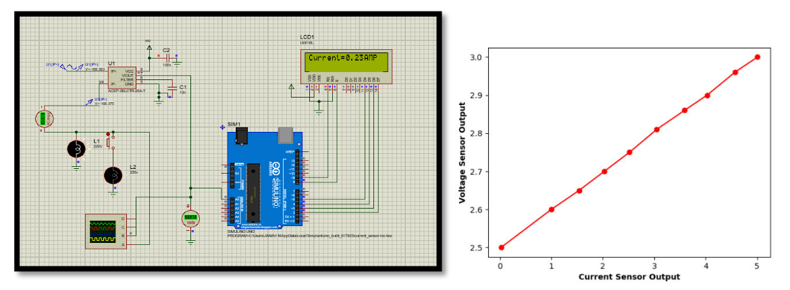

# Smart PrePaid Electric Meter
We Designed and created a smart electric meter, which is connected to the user through gsm, We have used a custom method to determine the current and the voltage running through the circuit. 

Done by: 
Chandravaran Kunjeti 
Shruti Masand 
Janavi N  
Shashank Hola 

## Table of Contents
1. [Steps to use the project](#Steps-to-use-the-project)
2. [Abstract](#Abstract)
3. [Block Diagram](#Block-Diagram)
4. [Current Sensor](#Current-Sensor)
5. [Voltage Sensor](#Voltage-Sensor)
6. [Zero Crossing Detector](#Zero-Crossing-Circuit)
7. [References](#references)

## Steps to use the project

1) The first step invloves you to complie the arduino code in arduino ide and then upload the hex files into the arduino they have been labeled as bottom and top for easy understanding.

2) The gsm modules hex file also has to be uploaded onto it.

3) The same thing have to be done for both circuits.

## Abstract
The aim of the project was to allow consumers to keep track of energy usage, design circuits to measure voltage and currents, allow us to communicate directly using GSM module. We were successfully able to implement the system on simulation.
Below is a small explanantion of the components.

## Block Diagram 

Due to the large number of devices and sensors required for the experiment, we have used 2 Arduino UNOs, One sensor is supposed to measure the readings directly from the source, while the other measures it across the load. This allows us to detect theft. The Top arduino communicates it's reading to the bottom one, where the theft detection takes place. After determining the ammount of power consumed some amount of cash is deducted from the users account. Any notification to the user happens via the GSM module.

## Current Sensor

We use the **ACS71** current sensor which is widely available in the market. But before using the sensor we require check its responce with different AC current readings. Below is a picture of the analysis.

As we can see almost close to a linear relation, we decided to us this sensor.

## Voltage Sensor

We designed a custom voltage sensor using the knowledge of rectifiers and regulators. The circuit is rectifier followed by a regulator. We also conducted a small experiment to check if the input and output are with a linear relation.

As expected there is a linear relation between the input and output.

## Zero Crossing Detector

Is a circuit that can be used to determine the power factor, based on the phase angle difference between the current and voltage.

## Full Circuit 

Above is the circuit picture of what was implemented. To have a better understanding please go through the [report](ASD_project_report.pdf), and the Youtube videos - [No Theft](https://youtu.be/pOC98SzZm9Y), [Theft](https://youtu.be/HM0Sl908DR4)
